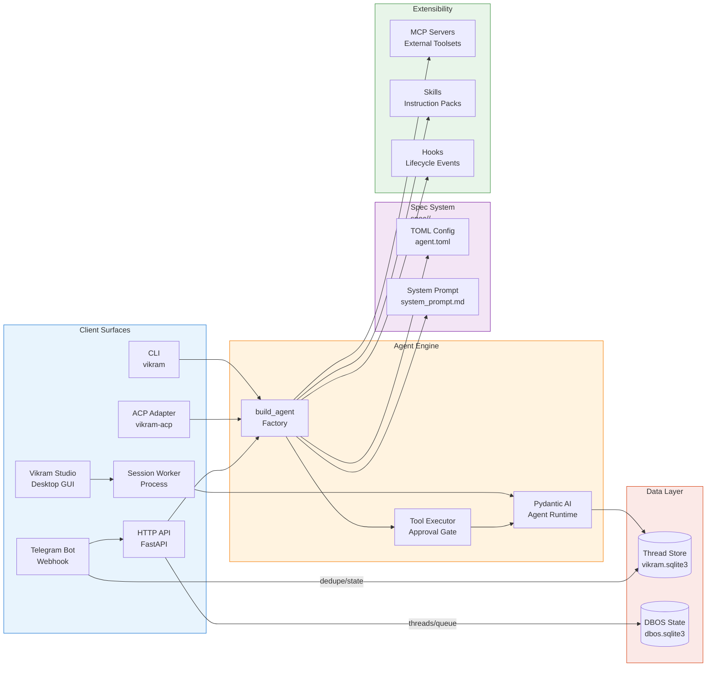
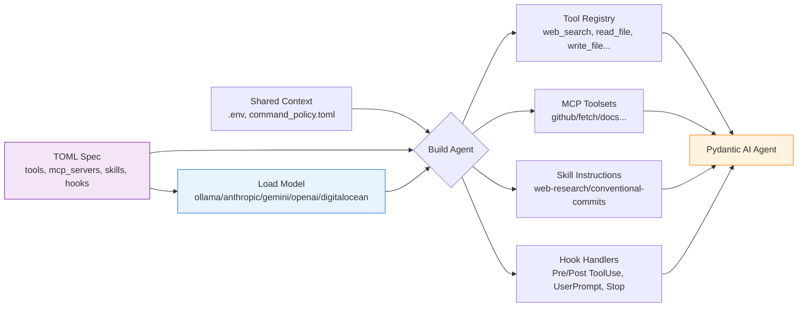
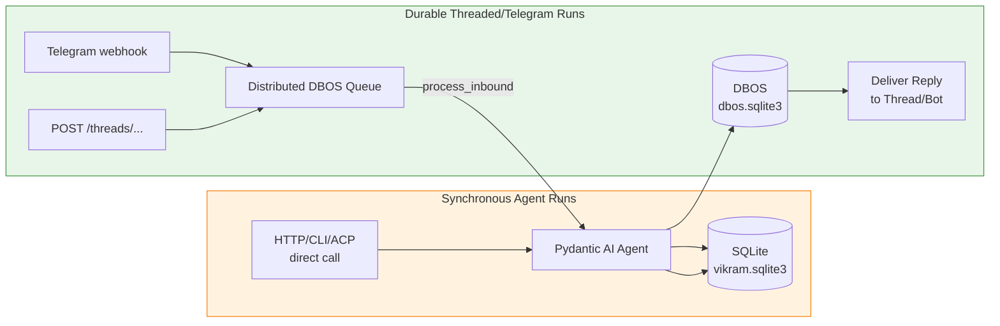

# Vikram

Vikram is a public, standalone agent runtime built on Pydantic AI. It keeps
agent behavior in versioned specs under `spec/`, exposes the same agents through
CLI, HTTP, threaded queues, Telegram webhooks, ACP, and a desktop GUI, and ships
safe local coding tools for the CLI-only `coder` agent.

## Architecture



### Agent Builder Pipeline



## Quick Start

```bash
uv sync
uv run vikram configure
uv run vikram --once --prompt "say pong"
```

Vikram does not ship with a default model provider or model name. Run
`vikram configure` (alias: `vikram setup`) once after installing: it walks a
menu of providers, lets you configure as many as you want in one session
(model + API key per provider), and asks which one is the default. Settings
are stored in `~/.config/vikram/config.toml`; environment variables and `.env`
still override that local file for development and deployment.

The wizard is safe to re-run at any time — it merges into the existing file,
so adding or updating one provider never discards the others. Package updates
(`vikram update` or the installer) never touch it either.

### Model Providers

| Provider id | Backend | API key env var |
| --- | --- | --- |
| `ollama` | Local Ollama | — |
| `ollama-cloud` | [ollama.com](https://ollama.com) hosted models | `OLLAMA_API_KEY` |
| `anthropic` | Anthropic Claude | `ANTHROPIC_API_KEY` |
| `gemini` | Google Gemini | `GEMINI_API_KEY` (or `GOOGLE_API_KEY`) |
| `openai` | OpenAI | `OPENAI_API_KEY` |
| `digitalocean` | DigitalOcean serverless inference | `DIGITALOCEAN_ACCESS_TOKEN` |
| `openai-compatible` | Any OpenAI-compatible endpoint (e.g. Sarvam AI) | `VIKRAM_OPENAI_COMPAT_API_KEY` |

The resulting config looks like:

```toml
config_version = 2
default_provider = "anthropic"

[providers.anthropic]
model = "claude-sonnet-5"
api_key = "sk-ant-..."

[providers.ollama]
model = "llama3.2"
base_url = "http://localhost:11434"
```

Model resolution per agent, highest to lowest: `VIKRAM_MODEL_PROVIDER` /
`VIKRAM_MODEL` / `-m` (one run) → your saved per-agent choice
(`[agents.<name>]`, written by the in-session `/model` command) → the agent
spec's pinned model → the config file's `default_provider` and that
provider's model. An agent that pins its own model (like `coder`) therefore
keeps it even when the global default points elsewhere, until you switch it
with `/model`.

For local Ollama, pull a model you want to use before configuring it:

```bash
ollama pull <model-tag>
ollama serve
```

Equivalent `.env` settings for local Ollama:

```env
VIKRAM_MODEL_PROVIDER=ollama
VIKRAM_MODEL=<model-tag>
OLLAMA_BASE_URL=http://localhost:11434/v1
```

Equivalent `.env` settings for a hosted provider (Anthropic shown; use the
matching key env var from the table for the others):

```env
VIKRAM_MODEL_PROVIDER=anthropic
VIKRAM_MODEL=claude-sonnet-5
ANTHROPIC_API_KEY=...
```

## Client Surfaces

### CLI (`vikram`)

Interactive chat with model switching, one-shot prompts, JSON output, and self-update:

```bash
uv run vikram configure           # multi-provider setup wizard (alias: vikram setup)
uv run vikram                     # interactive REPL session
uv run vikram --agent coder       # CLI-only coding agent
uv run vikram exec "summarize this"   # non-interactive, reads stdin if no prompt
uv run vikram doctor              # diagnostics check
uv run vikram gui                 # open the desktop app
```

`vikram exec [PROMPT]` is the preferred non-interactive interface. When the
positional prompt is omitted it reads stdin. When both are present, stdin is
added as context for the positional instruction. `-C/--cd` selects the working
directory before configuration and specs are loaded, `-m/--model` overrides the
model for that run, and `-o/--output-last-message` also saves the final reply to
a file. The older `--once --prompt` form remains supported for existing scripts.

Interactive sessions support `/status` (active agent, model, directory, context),
`/model` (switch models with saved default), `/diff` (inspect working tree),
`/copy` (copy last reply), and `/new` (start fresh conversation). Run
`vikram doctor` when setup or agent loading is not behaving as expected.

The `coder` agent is CLI-only by spec (`cli_only = true`). It can read/search
files, request approval for edits, and run commands through
`spec/shared/command_policy.toml`. CLI-only specs are rejected by HTTP, threaded,
and Telegram surfaces.

The default `vikram` agent acts as an orchestrator: it sees available subagents
and can call `delegate_to_agent` with a self-contained prompt when a specialized
agent should do the work. In the interactive CLI, that delegation is shown as a
normal tool call before the subagent runs.

The CLI UX research and implementation rationale are documented in
[docs/cli_ux_research.md](docs/cli_ux_research.md).

### HTTP API (`vikram-api`)

```bash
uv run vikram-api                  # start the API server
curl http://127.0.0.1:8000/healthz # liveness check
curl -X POST http://127.0.0.1:8000/chat --json '{"prompt":"say pong"}'
```

Endpoints:

| Method | Path | Description |
| --- | --- | --- |
| `GET` | `/healthz` | Liveness check (no dependency work) |
| `GET` | `/readyz` | Readiness: model config, thread store, default agent |
| `POST` | `/chat` | Stateless one-shot run |
| `POST` | `/threads/{interface}/{thread}/messages` | Queue a durable threaded run |
| `GET` | `/events/{workflow_id}` | Read DBOS workflow status |
| `POST` | `/telegram/webhook` | Default Telegram bot webhook |
| `POST` | `/telegram/{bot_name}/webhook` | Named Telegram bot webhook |

Every response carries an `x-request-id` header, echoing the inbound one when
present. That id is attached to every log line emitted while handling the
request.

### Desktop App (`vikram gui`)

`vikram gui` opens **Vikram Studio** — a Tauri-based desktop application for:

- Building and editing agents from tools, MCP servers, and skills (visual agent editor)
- Running agents against a workspace with native approval dialogs
- Comparing one agent across 2–4 models side-by-side (playground)
- Doctor checks for agent health inspection
- Settings management for providers and agent specs

The desktop app uses an HTTP session worker to communicate with the API, supporting
real-time event streaming and process-isolated agent execution.

See [docs/desktop_app.md](docs/desktop_app.md) for install and build steps.

### ACP (Agent Client Protocol)

`vikram-acp` exposes the local `coder` agent through the
[Agent Client Protocol](https://agentclientprotocol.com), enabling editor
integration from clients like Zed or Neovim. Every turn is executed by
`build_agent` and Pydantic AI streaming; only the I/O surface changes from a
Rich REPL to JSON-RPC `session/update` notifications over stdio.

```bash
vikram-acp --agent coder    # start ACP server for editor integration
```

### Telegram Bot

`spec/telegram.toml` declares the default `vikram` bot and resolves secrets from
environment variables:

```env
VIKRAM_TELEGRAM_BOT_TOKEN=
VIKRAM_TELEGRAM_WEBHOOK_SECRET=
VIKRAM_TELEGRAM_ALLOWED_CHAT_IDS=123456789,-1001234567890
VIKRAM_TELEGRAM_BOT_USERNAME=VikramBot
```

Register a local webhook (useful for development with ngrok/localtunnel):

```bash
uv run python -m vikram.local_webhook https://example.ngrok-free.app
```

Or deploy via Docker:

```bash
docker compose -f compose.example.yml --env-file .env up --build
```

## Build Agents (Spec-Driven)

Vikram agents are defined declaratively as TOML specs plus Markdown prompts.
Each agent lives in `spec/<agent>/` with its own `agent.toml` and
`system_prompt.md`.

### The `vikram` Agent (`spec/vikram/`)

Public-safe general-purpose assistant:

```toml
name = "Vikram"
description = "General-purpose assistant agent."
model_provider = "ollama"
model = "gemma4:26b-a4b-it-qat"
tools = ["web_search", "delegate_to_agent"]
shared_skills = ["skills/web-research"]
```

### The `coder` Agent (`spec/coder/`)

CLI-only local coding agent with file/edit/command tools:

```toml
name = "Coder"
description = "CLI-only coding agent for local repository work."
cli_only = true
model_provider = "ollama"
model = "qwen3.6:35b-mlx"   # MLX MoE model, optimized for Apple Silicon
tools = [
    "read_file", "glob", "grep", "inspect_command",
    "write_file", "edit_file", "run_command",
]
skills = ["skills/conventional-commits"]
```

Agent spec fields (loaded by `vikram/spec.py`):

| Field | Description |
| --- | --- |
| `name`, `description` | Human-readable identity |
| `system_prompt` | Reference to `system_prompt.md` |
| `model_provider`, `model` | Optional agent-level model override |
| `cli_only` | Reject from HTTP/Telegram/Threaded surfaces |
| `tools` | Names resolved from `vikram.tools.TOOL_REGISTRY` |
| `mcp_servers[]` | External Model Context Protocol tool servers |
| `skills[]`, `shared_skills[]` | Discovery skill instruction packs |
| `context_files[]`, `shared_context_files[]` | Context documents injected into prompt |
| `hooks[]` | Lifecycle hook handlers |

The spec store (`vikram/specstore.py`) manages a two-root layout: shipped specs
live inside the installed wheel or git checkout (read-only), while user-created
agents go to `~/.config/vikram/agents/`. Editing a built-in agent copies it across
first, leaving the original intact.

## Extensibility

### MCP Servers

Agents can attach external Model Context Protocol tool servers in their spec:

```toml
[[mcp_servers]]
name = "github"
transport = "stdio"             # stdio | http | sse
command = "npx"
args = ["-y", "@modelcontextprotocol/server-github"]
env = { GITHUB_PERSONAL_ACCESS_TOKEN = "${GITHUB_TOKEN}" }
tool_prefix = "gh"              # namespace tools as gh_*
```

See [docs/mcp_and_skills.md](docs/mcp_and_skills.md) for the full reference.

### Skills

Skills are folders of expert instructions (`SKILL.md` with `name` and
`description` frontmatter). Only each skill's name and description load up front;
the full body is loaded on demand through the `load_skill` tool.

```toml
skills = ["skills/conventional-commits"]     # agent-local
shared_skills = ["skills/web-research"]      # under spec/shared/
```

### Hooks

Hooks run your own code at agent lifecycle events to observe, augment, or block
what the agent does. They are declared per agent in `spec/<agent>/agent.toml`
under `[[hooks]]` and apply on every surface.

- **Events**: `PreToolUse` and `PostToolUse` (wrap every tool call; may block),
  `UserPromptSubmit` (inject context or block a run), and `Stop` (advisory).
- **Transports**: `command` — external program receiving JSON on stdin, exit 2 blocks;
  `python` — in-process callable `module:function`.

```toml
[[hooks]]
event = "PreToolUse"
matcher = "run_command"           # glob on tool name (default "*")
transport = "command"
command = "./hooks/guard.sh"      # exit 2 blocks the call

[[hooks]]
event = "Stop"
transport = "python"
entrypoint = "myhooks.notify:on_stop"
```

See [docs/hooks.md](docs/hooks.md) for the full reference.

## Tools

The built-in tool registry (`vikram/tools.py`) provides different capabilities per agent:

| Tool | Description | Guard |
| --- | --- | --- |
| `web_search` | Parallel web search across providers | None |
| `read_file` | Read file contents (max 200 lines) | None |
| `glob` | Find files by pattern (max 200 matches) | None |
| `grep` | Search file contents (max 100 matches) | None |
| `inspect_command` | Preview command with policy check | Always |
| `write_file` | Write file contents | Approval-gated |
| `edit_file` | In-place edit using search/replace | Approval-gated |
| `run_command` | Execute shell commands | Policy + approval |
| `delegate_to_agent` | Orchestrate a subagent by name | None |
| `load_skill` | Load skill instructions on demand | None |

Command policy (`spec/shared/command_policy.toml`) controls which commands are
allowed, required to be inspected before running, or need manual approval.
Sensitive file reads (`.env`, SSH keys, terraform state) are blocked by default.

## Data Layer

| Component | Storage | Purpose |
| --- | --- | --- |
| Thread History | `.vikram/vikram.sqlite3` | Conversation message history per agent per thread |
| DBOS State | `.vikram/dbos.sqlite3` | Workflow queue state, distributed tracing propagation |
| Config | `~/.config/vikram/config.toml` | Model provider settings (schema v2) |

## Data Layer Flows



## Model Providers

Vikram supports seven model provider backends registered in
`vikram/providers.py`. Each provider specifies how credentials and endpoints are configured,
and how to build the underlying Pydantic AI model. Provider resolution follows a
priority chain: env vars → per-agent spec pin → global config default.

## Desktop App (Vikram Studio)

`vikram gui` launches **Vikram Studio**, a Tauri desktop application built with TypeScript/React and Rust:

| Component | Description |
| --- | --- |
| `gui/src/` | React UI — agent editor, chat sessions, playground, doctor checks, settings |
| `gui/src-tauri/` | Rust backend — API binary resolution, session management, native dialogs |
| Agent Editor | Visual TOML editing with validation from `vikram/introspect.py` |
| Multi-Model Playground | Compare 2–4 models side-by-side on the same prompt via `vikram/playground.py` |
| Approval Dialogs | Native OS approval for safety-gated tool calls (write, edit, run_command) |

The desktop starts via the CLI command `vikram gui`, which locates the running
`vikram-api` binary and passes it into the app. The app communicates with the
API through SSE streams on active sessions.

## Observability

- **Logging**: JSON-structured logs via `structlog`, configurable per-stream (stdout for servers, stderr for workers).
- **Tracing**: OpenLIT/OpenTelemetry integration. Trace context propagates across the DBOS queue boundary via W3C `traceparent`/`tracestate` headers embedded in CloudEvents.
- **Endpoints**: `/healthz` (liveness), `/readyz` (readiness with dependency checks).
- **Per-request correlation**: Every response carries `x-request-id`, attached to all log lines and spans for that request.

## Install

### Zero-Auth Install (Recommended)

```bash
curl -LsSf https://raw.githubusercontent.com/raniendu/vikram/main/install.sh | bash
```

Single command downloads the installer, installs `uv` if missing, fetches Vikram source,
and configures your environment. The wizard merges into your existing config file.

### From a Git Checkout

```bash
VIKRAM_INSTALL_DIR="$HOME/.local/share/vikram" bash install.sh
```

Install metadata lands in `~/.config/vikram/install.toml` so `vikram update` can fast-forward.

## Docker

```bash
docker compose -f compose.example.yml --env-file .env up --build
curl http://localhost:8000/healthz
```

The included `compose.example.yml` brings up Vikram with Ollama on a private network. Add
your own reverse proxy and TLS termination for production. The Dockerfile uses Debian trixie
(ships SQLite 3.46+, which DBOS requires).

## Development

```bash
uv sync --locked
uv run pytest
uv run pre-commit run --all-files
docker compose -f compose.example.yml config
```

Default tests are offline and deterministic. Live model, web search, Telegram,
and tracing flows require explicit environment configuration.

## Documentation

| File | Content |
| --- | --- |
| [docs/current_architecture.md](docs/current_architecture.md) | Detailed module table and request flow documentation |
| [docs/deployment.md](docs/deployment.md) | Deployment, logging, and tracing details |
| [docs/desktop_app.md](docs/desktop_app.md) | Desktop app install and build instructions |
| [docs/hooks.md](docs/hooks.md) | Lifecycle hooks reference (Pre/Post ToolUse, UserPromptSubmit, Stop) |
| [docs/mcp_and_skills.md](docs/mcp_and_skills.md) | MCP server specs and skills configuration |
| [docs/tools.md](docs/tools.md) | Built-in tool registry documentation |
| [docs/cli_ux_research.md](docs/cli_ux_research.md) | CLI UX research and implementation rationale |
| [docs/telegram_live_testing.md](docs/telegram_live_testing.md) | Telegram webhook testing workflow |
| [docs/threaded_conversations.md](docs/threaded_conversations.md) | Threaded conversation architecture deep dive |
