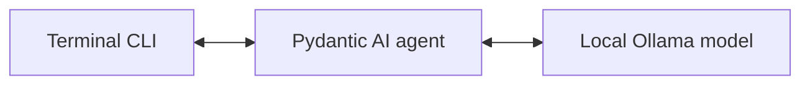

# Vikram

One local assistant, built with Pydantic AI and Ollama.

Vikram runs a single agent defined in this repository. Its instructions live in
`vikram/agent.py`, and it sends model requests to your local Ollama server at
`http://localhost:11434/v1`.

## Run

Install [uv](https://docs.astral.sh/uv/) and [Ollama](https://ollama.com/). Start
the Ollama app, or start its server in a terminal:

```bash
ollama serve
```

If Ollama is already running, skip `ollama serve`. In another terminal:

```bash
uv sync --locked
ollama pull gemma4:26b-a4b-it-qat
uv run vikram
```

Or ask one question:

```bash
uv run vikram "Explain Python generators in three sentences."
```

Conversation history exists only in memory for the current interactive session.
Chat conversations are not saved between runs. Type `/exit` or press Ctrl-D to exit.

## Choose a local model

The default is `gemma4:26b-a4b-it-qat`. To use another model you have pulled into
Ollama, pass its name:

```bash
uv run vikram --model MODEL_NAME "Hello"
```

You can also set `OLLAMA_MODEL`. The command-line option takes precedence over
that environment variable, which takes precedence over the default. Model
selection changes the model used by the same agent.

## Code

- `vikram/agent.py`: the agent's instructions, default model, and `build_agent`.
- `vikram/cli.py`: one-shot and interactive terminal conversations.
- `vikram/__main__.py`: entry point for `python -m vikram`.
- `vikram/evals/`: starter cases, evaluation runner, metrics history, and HTML report.



The agent is defined directly in Python; no spec folder is needed.

The assistant has no tools, delegation, API server, or desktop app. Evaluation
grading also uses local Ollama, and evaluation metrics are saved locally. The
application does not load `.env` files.

## Evaluate the agent

Evaluations are run manually with [Pydantic Evals](https://ai.pydantic.dev/evals/).
The eight starter cases cover arithmetic, text transformation, sorting, JSON
extraction, summarization, grounded answers, explanation, and honesty about
unavailable information. They establish a small baseline, not a comprehensive
quality benchmark.

Both answers and grading run locally through Ollama; no API key is needed.
The default rubric judge is `gemma4:26b-a4b-it-qat`, with thinking off and
temperature 0. Pull it into Ollama before evaluating. Objective checks compare
answers directly and do not use a judge.

```bash
uv sync --locked
uv run vikram-eval run --label "Baseline"
uv run vikram-eval run --model MODEL --judge-model gemma4:26b-a4b-it-qat
uv run vikram-eval run --samples 10 --k 1 3 5 10
```

By default, the benchmark discovers each model's supported thinking values from
Ollama's `/api/show` metadata and runs every value sequentially. Boolean controls
become off/on rows; named controls retain their exact levels. This follows
[Ollama's thinking API](https://docs.ollama.com/capabilities/thinking) and its
[OpenAI-compatible thinking controls](https://docs.ollama.com/api/openai-compatibility).
Every model/level gets a separate saved result. Eight cases with five attempts
and two levels means 80 agent attempts, plus grading for rubric cases.

Each case gets five sequential attempts **per thinking level**, with empty
conversation history each time and agent temperature 0.7. The runner uses two
phases to avoid switching between agent and judge models on every attempt:

1. Generate every case and thinking level for model A, then model B, and so on.
   Objective checks run immediately. Rubric answers wait in memory.
2. After all generation finishes, use the fixed judge to grade every queued
   answer sequentially. No agent generation happens during this phase.

The judge must find that every rubric criterion passes. Its judgments can be
imperfect, including when judging its own model's answers; the report separates
objective and judged results. Time limits are 300 seconds for a local answer
and 300 seconds for grading one answer. Requests may incur client retries;
wrong answers are never retried to improve their grade.

Use `--judge-model MODEL` to choose another installed local judge, and
`--judge-thinking off`, `on`, a supported named level, or `default` to choose one
fixed judge setting. The judge does not sweep thinking levels with the agent.
These settings are recorded; changing the judge model, provider, thinking,
temperature, or timeout starts a separate series for suites containing rubric
cases. Historical OpenRouter results remain readable in their original series.

For a focused run, repeat `--case`. This objective-only smoke check skips judging:

```bash
uv run vikram-eval run --case arithmetic --case sorting --samples 1 --k 1 --thinking default
```

Use `--thinking default` for one run with no thinking override, `--thinking off on`
for boolean controls, or `--thinking low medium high` when the model advertises
those levels. Explicit levels are validated before generating answers. If the
server has no thinking metadata, automatic coverage stops with an explanation;
update Ollama, or choose `--thinking default` for a run marked as unspecified.
The runner never guesses model levels or silently treats an unsupported level
as a measured one. A model advertising only `false` runs once, with thinking off.

Use `uv run vikram-eval run --help` to see the case IDs. To add a domain-specific
task later, add a `CaseSpec` with a unique ID and an explicit expected answer or
rubric to `vikram/evals/cases.py`. Text checks ignore only outer whitespace. JSON
checks parse the complete response and compare structure, values, and types;
Markdown fences or extra fields fail.

### Scores

- **Pass@1:** estimated probability that one fresh attempt succeeds.
- **Pass@k:** estimated probability that at least one of k independent attempts
  succeeds. It does not require every attempt to succeed or identify which
  answer to choose.
- **Unscored:** generation or grading failed, or an attempt was interrupted or
  not reached. This is different from an incorrect answer.

For each case, let `n` be the sample count and `c` the number of passes. The
[standard estimator](https://github.com/openai/human-eval/blob/master/human_eval/evaluation.py)
is `1 - C(n-c, k) / C(n, k)`, with `1 <= k <= n` and `C(a, k) = 0` when `a < k`.
Pass@1 simplifies to `c / n`. Two passes in five attempts yield pass@1 = 40%,
pass@3 = 90%, and pass@5 = 100%. These estimates describe the samples, not a
guarantee about future answers. The summary averages cases equally.

A case needs all its attempts scored before showing a score. An incomplete run
has no combined score; complete objective or judged subgroups can still show
their scores. A completed run exits 0 even if answers fail. Operational failures
and metadata/preflight failures exit 1, argument parsing errors exit 2, and
interruption exits 130. A single Ctrl-C saves the counts for every started
configuration; pending judgments remain unscored. Answers are never written to
disk, so interrupted runs cannot resume and an abrupt process kill can lose
unsaved work. There is no automatic regression gate.

### History and visual report

Every run saves a JSON metrics record under `.vikram/evals/v1/history/` and
rebuilds `.vikram/evals/v1/report.html`. Open the HTML file in your browser; on
macOS:

```bash
open .vikram/evals/v1/report.html
uv run vikram-eval report
```

The report starts with a compact benchmark summary: best observed pass@1,
pass@3, and evaluation time, with ties shown explicitly. Paired bars show
**pass@1 and pass@3 together for every configuration**. Findings describe the
observed change from baseline and estimated retry gains using matched runs.

The history section gives each metric its own progress card and graph,
including other recorded budgets such as pass@5. Cards compare the latest
complete result with the first complete result and show the best observed
score. They remain visible even when a score is unavailable; pass@3 needs at
least three attempts per case.

A quality-versus-time chart compares pass@1 with evaluation seconds per attempt.
Each model has a line connecting thinking Off to On, or its advertised named
levels in order, with a labeled point at each measured level. Agent revisions
stay on separate lines. Unmeasured levels are listed as “Not run” and break the
line; one measured level appears as a single point.
This is active run duration divided by attempt count, including grading and
overhead but excluding time spent on other configurations; it is not model-only
response latency. A per-case heatmap shows both pass@1 and
pass@3, using the same complete-run cohorts as the configuration table. Exact
values accompany the charts, tables scroll on small screens, and the glossary
explains the metrics and their limits.

The configuration table shows every recorded model and its advertised thinking
levels, including “Not run” rows for untested levels. Repeated runs of the same
configuration and thinking level are averaged, with the latest score underneath.
Charts and summaries use actual model names and thinking levels; revision labels
distinguish different versions of the same model.
Prompt, runtime/tool, dependency, or harness changes produce separate table
entries and remain on the same timeline. Different thinking levels are never
pooled into one score.

Every eval suite appears in its own section, newest first. There are no metric,
experiment, or suite filters. Experiment labels appear directly in the history.
Optional details provide a two-run comparison with baseline/candidate selectors,
all metrics, recorded differences, and per-case changes. Select a history row or
graph point to inspect a run. Everything works offline; rebuilding needs neither
Ollama nor credentials.

An **eval series** keeps the measuring criteria fixed: selected cases, expected
answers/rubrics, grading policy, and judge settings. Changing these starts a
separate series. Changing the agent does not. Different sample counts can
estimate the same pass@k when both have at least k attempts, but their
uncertainty differs. Incomplete results are gaps, never zero scores.

Use labels to describe successive changes, keeping the same cases and judge:

```bash
uv run vikram-eval run --label "Baseline"
# Edit the agent's system prompt, runtime, or dependencies, then evaluate again.
uv run vikram-eval run --label "Clearer system prompt"
```

For a deliberate comparison, annotate runs with `--experiment`. After pulling
both local models into Ollama, benchmark them and all their supported thinking
levels together while holding the working tree and eval settings fixed:

```bash
uv run vikram-eval run --model MODEL_A --model MODEL_B --experiment "Model comparison"
```

Choose two runs at the same thinking level in the optional comparison panel to
inspect whether only the model changed in the recorded settings. Or compare
thinking levels for one model. The same workflow supports comparisons after
changing tools or the harness; describe the change in the label. Labels do not
modify the agent or prove that other settings stayed fixed. Runs are saved when
their grading finishes (immediately after generation for objective-only runs).
A single Ctrl-C also saves partial counts for all started configurations. Model
or grader failures mark a configuration incomplete and do not skip later levels.

Each run records a system-prompt hash, hashes of the Python runtime code under
`vikram/` (excluding eval code), installed dependencies and dependency manifests,
Python/Pydantic versions, requested thinking value and supported levels, Git
commit, and whether the working tree had local
changes. Report or documentation edits alone do not create a new agent
configuration. If the snapshot changes during answer generation, full provenance is
withheld. Legacy records stay visible in separate legacy series; their missing
runtime/dependency snapshots cannot be reconstructed or used to verify a
model-only comparison. Unspecified thinking defaults are not retroactively
assigned a level and cannot establish a controlled thinking comparison.

These fingerprints do not capture every environment variable, external service,
non-Python tool resource, or mutable model tag. Use stable model versions for
controlled comparisons. Five attempts give a rough signal; repeat promising
comparisons before drawing conclusions. The best observed score is not proof
that a configuration will consistently perform best.

Only labels, timestamps, model IDs, configuration metadata, hashes, counts,
durations, and scores enter the report or history. Keep labels free of private
content. Prompts, answers, thinking traces, judge explanations, source content,
exception bodies, and credentials are not saved. Artifacts are ignored by Git; older evaluation
state is preserved. Both commands accept `--directory PATH` for a separate
history/report directory. Use the same directory to keep a shared timeline;
keep it out of version control.

## Development

Python 3.13 or later is required.

```bash
uv sync --locked
uv run vikram --help
uv run vikram-eval --help
uv run black --check vikram
uv run isort --check-only vikram
```

The startup and formatting checks do not require a model server. Live
evaluations do not run in CI or Git hooks. To install optional
formatting hooks, run `uv run pre-commit install`.
