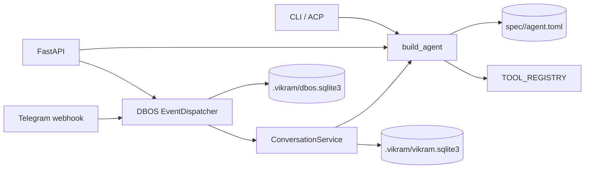

# Current Architecture

Vikram is a standalone Python app built around spec-defined Pydantic AI agents.

## Modules

| Module | Responsibility |
| --- | --- |
| `vikram/settings.py` | Env configuration and model provider setup |
| `vikram/spec.py` | Loads TOML agent specs and assembles instructions |
| `vikram/agent.py` | Builds Pydantic AI agents from specs, settings, and tools |
| `vikram/cli.py` | Interactive and one-shot CLI |
| `vikram/acp.py` | ACP adapter for local editor integration |
| `vikram/api.py` | FastAPI routes and app lifespan |
| `vikram/gateway.py` | SQLite thread store and conversation service |
| `vikram/dbos_gateway.py` | DBOS queues/workflows and Telegram reply delivery |
| `vikram/telegram.py` | Telegram webhook parsing, allowlist, commands, formatting |
| `vikram/tools.py` | Web search and local coding tools |
| `vikram/command_policy.py` | Declarative command execution policy |

## Request Flows

`POST /chat` is stateless. It loads or reuses an agent and calls
`agent.run(prompt, conversation_id="chat:<agent>")`.

`POST /threads/{interface}/{thread}/messages` creates an `InboundMessage`,
enqueues a DBOS workflow, loads prior message history from SQLite, runs the
agent, and persists the new history.

Telegram webhooks validate the Telegram secret header, dedupe updates in
SQLite, enforce the configured allowlist, handle `/start`, `/help`, `/reset`,
and `/agent`, then enqueue ordinary text messages through the threaded flow.

## Built-In Specs

- `vikram`: public-safe general assistant with `web_search`.
- `coder`: CLI-only local coding agent with file/search/edit/command tools.

Specs with `cli_only = true` are rejected by HTTP, threaded, and Telegram
surfaces.
